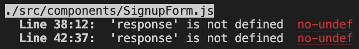

# Book Search Engine
AS AN avid reader
I WANT to search for new books to read
SO THAT I can keep a list of books to purchase

## Table of Contents
* [How it works](#how-it-works)
* [Features](#features)
* [Technoliges Used](#technologies-used)
* [Deployed URL](#deployed-url)
* [Notes](#notes)

## How it works:
- User can use the Search for Books menu by clicking the option
- After enter a search term then click submit button
- The search results will show up with book's title, author, description, image, and a link to that book on the Google Books site
- User can create an account, log in to the site
- User can save books by clicking Save buton on a book

### Example:


## Features:
- User can search books, add/remove books using their account
- JWT Token was used for authentication
- GraphQL & Apollo Server were used

## Technologies Used:
1. JWT Token
```javascript
const jwt = require('jsonwebtoken');
```

2. GQL & Apollo Server
```javascript
const { gql } = require('apollo-server-express');

const typeDefs = gql`
  type User {
    _id: ID!
    username: String!
    email: String
    bookCount: Int
    savedBooks: [Book]
  }
```

## Deployed URL
https://book-search-engine-mern.herokuapp.com/


## Notes
I had the module 21 open on the side to follow step by step for this challenge. I had encounterd many `Failed to compile` error because of the starter code. I tried not to mess up with much on the starter code, I ended up NOT including a line from the module content `const userData = Data?.me || {};`. Also, I had many `'response' is not defined` issues on componenets & pages. 
As a student who does not like having an error, especially from the starter code, this was a very hard. However, i could learn a lot since it made me practice on reading the errors and troubleshooting it.
### Example



